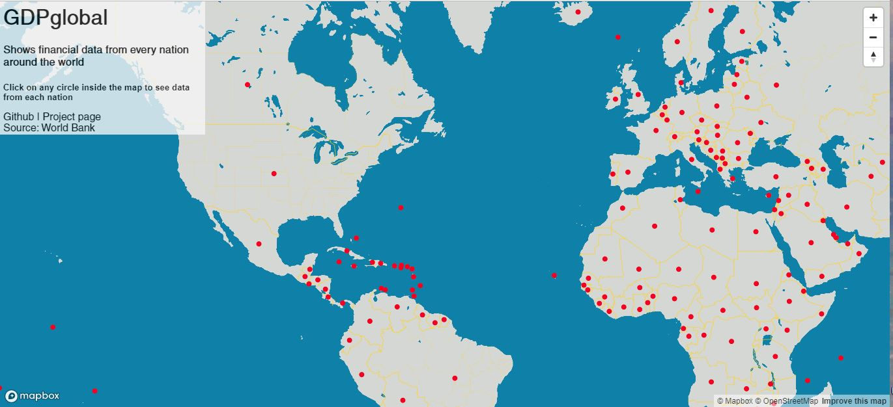

# GDPglobal

SPA data visualizer created in React. Shows financial data for over 200 nations around the world. Have the financial information for almost every country on planet earth with a few swipes and clicks on your screen. App currently does not work in the Internet Explorer Browser.

###  Current data it provides:

- Exports per year in thousands of $US dollars
- GDP per year in thousands of $US dollars
- Imports per year in thousands of $US dollars

### Future goals:

- [ ] Current Human Development Index per country
- [ ] Capital city for each country
- [ ] Trade growth percentage

### Source

- [World Bank/WITS](https://wits.worldbank.org/countrystats.aspx?lang=en)